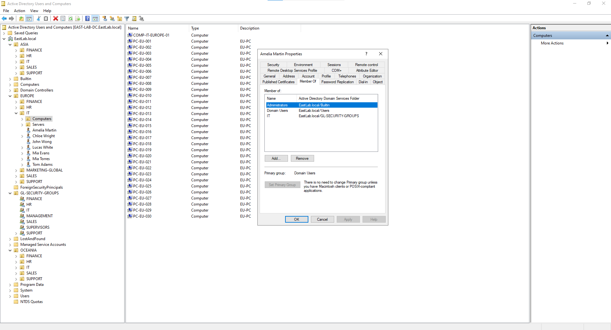
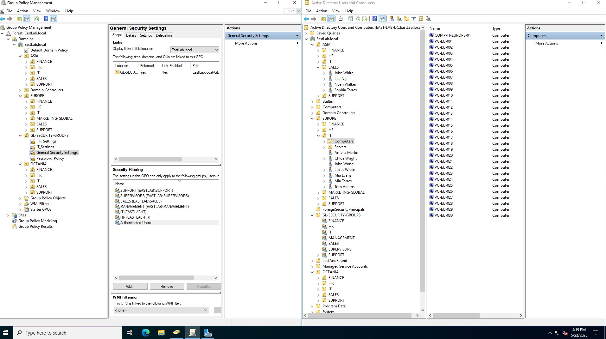
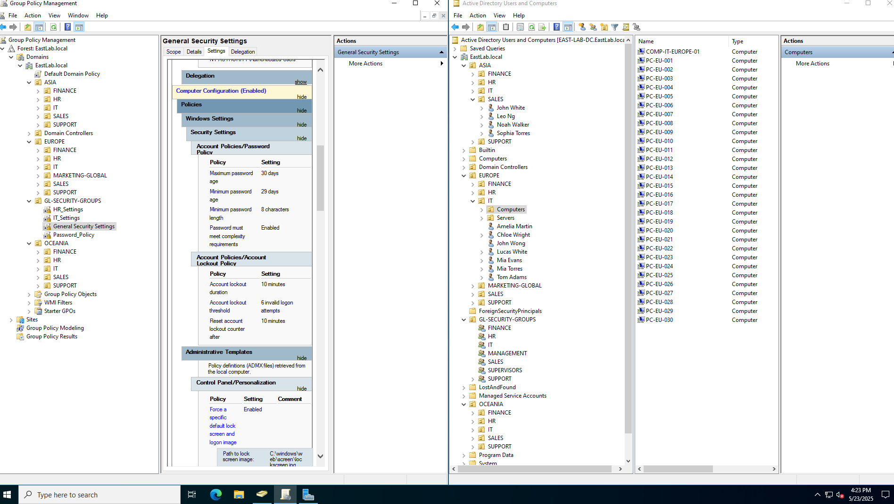
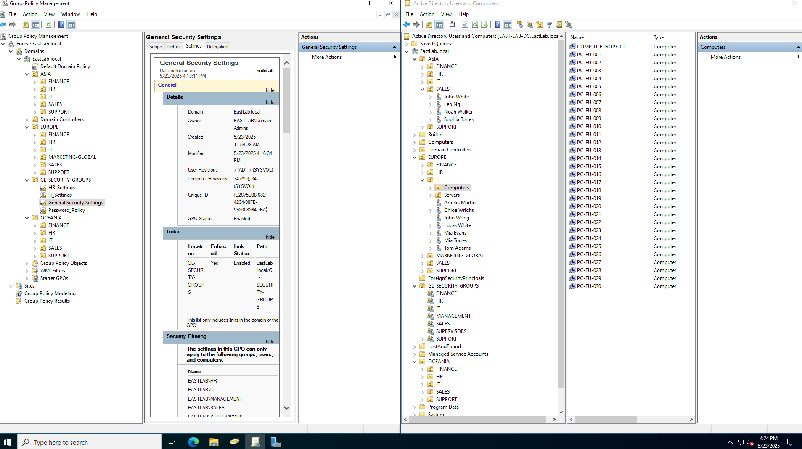
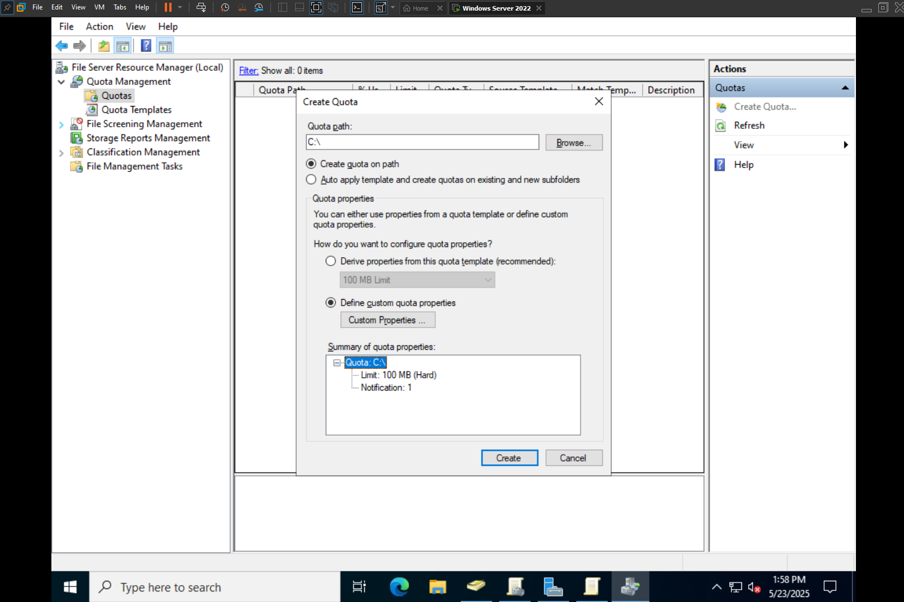
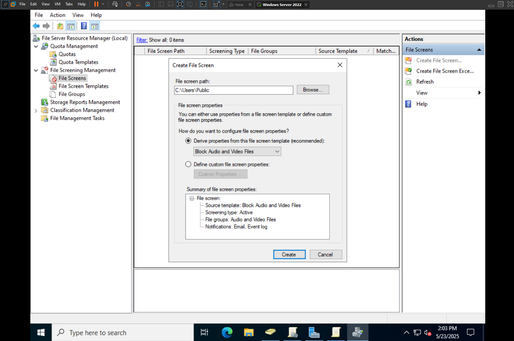
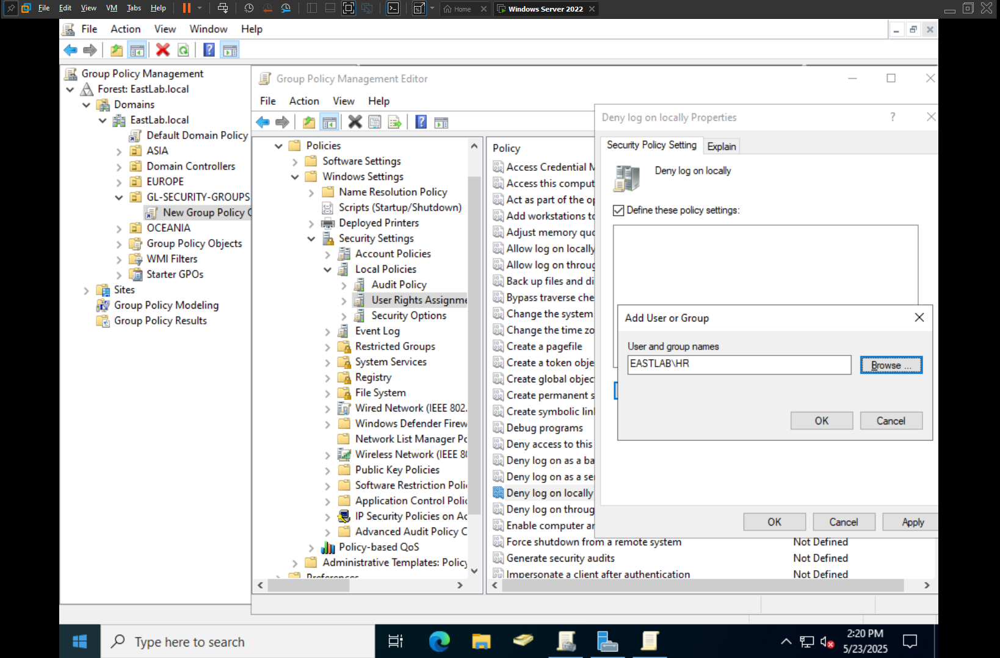

| Image                       | Description                                                                                                                                                                                                                                                                                                                                                                                                                                                                                                                                                                                                                                                                                    |
| --------------------------- | ---------------------------------------------------------------------------------------------------------------------------------------------------------------------------------------------------------------------------------------------------------------------------------------------------------------------------------------------------------------------------------------------------------------------------------------------------------------------------------------------------------------------------------------------------------------------------------------------------------------------------------------------------------------------------------------------- |
|   | Domain:"EAST-LAB-DC.eastlab.local" Structure: Regions: Asia, Europe, Oceania Departments within each region: Hr, Finance, Sales, Support, etc. Separate ou's for Computers and Users Example User: Amelia Martin Member of: Asia, Domain Users, IT group                                                                                                                                                                                                                                                                                                                                                                                                                     |
|              | Here i have my Group Policy Management Console (left) and Active Directory Users And Computers (right). It illustrates how a Group Policy Object (gpo) named General Security Settings is linked to the domain and filtered to apply only to specific security groups. On the right, the ad structure is organized by region and department, showing users and computers.                                                                                                                                                                                                                                                                                                                      |
|  | This image displays the **Group Policy Management Console** (left) and **Active Directory Users and Computers** (right). The GPO titled **General Security Settings** is linked to the domain and enforces key security policies such as password complexity, account lockout thresholds, and screen lock behavior. On the right, the AD structure is neatly organized into regions and departments, with users and computers sorted into their respective Organizational Units (OUs), reflecting a well-structured and scalable domain layout.                                                                                                                                                |
|           | This shows the **Group Policy Management Console** and **Active Directory Users and Computers**. The **General Security Settings** GPO is selected, with details including its creation time, versioning, and security filtering. It is linked to the domain and applies only to specific security groups such as IT, HR, Management, and Sales. On the right, the Active Directory is organized by region and department, displaying both users and computer objects in a structured and scalable hierarchy.                                                                                                                                                                                  |
|              | Here the File Server Resource Manager (FSRM) on a Windows Server system, focused on the Quota Management section. The "Create Quota" window is open, where a quota is being configured for the C:\ drive. In this setup, a hard quota limit of 100 MB is applied, meaning no additional data can be written once the limit is reached. Instead of using a predefined template, custom quota properties are defined. The summary below confirms that the limit is in place and includes a notification setting, which is useful for monitoring storage usage and ensuring users stay within allocated disk space.                                                                               |
|         | This displays the File Server Resource Manager with a focus on File Screening Management. The "Create File Screen" window is open, showing a configuration for the path C:\Users\Public. The file screen is set to use a predefined template that blocks audio and video files. This setup actively monitors the selected directory and prevents users from saving media files there. Notifications are enabled to alert administrators via email and event logs whenever a restricted file type is detected, helping enforce storage policies and maintain compliance with organizational guidelines.                                                                                         |
|      | This shows a configuration within the Group Policy Management Console, specifically under the User Rights Assignment settings in the Local Policies section. A new group policy object is being edited to configure the "Deny log on locally" setting. In this policy, the group **EASTLAB\HR** is being added, which means users within the HR group will be explicitly denied the ability to log on directly to machines targeted by this policy. This type of restriction is commonly used to enhance security by limiting access to sensitive systems or ensuring that certain user groups access resources only through approved methods such as Remote Desktop or specific applications. |
