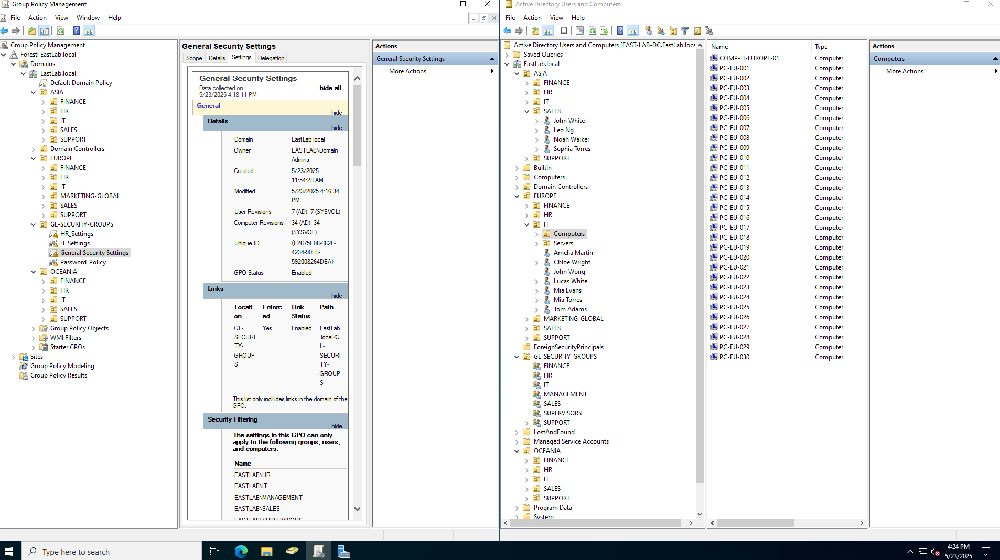

| Image                       | Description                                                                                                                                                                                                                                                                                                                                                               |
| --------------------------- | ------------------------------------------------------------------------------------------------------------------------------------------------------------------------------------------------------------------------------------------------------------------------------------------------------------------------------------------------------------------------- |
|   | Domain:"EAST-LAB-DC.eastlab.local" Structure: Regions: Asia, Europe, Oceania Departments within each region: Hr, Finance, Sales, Support, etc. Separate ou”s for Computers and Users Example User: Amelia Martin Member of: Asia, Domain Users, IT group                                                                                                |
|              | Here i have my Group Policy Management Console (left) and Active Directory Users And Computers (right). It illustrates how a Group Policy Object (gpo) named General Security Settings is linked to the domain and filtered to apply only to specific security groups. On the right, the ad structure is organized by region and department, showing users and computers. |
| ![[GeneralSettings-AD.png]] |                                                                                                                                                                                                                                                                                                                                                                           |
|           |                                                                                                                                                                                                                                                                                                                                                                           |
|               |                                                                                                                                                                                                                                                                                                                                                                           |
|              |                                                                                                                                                                                                                                                                                                                                                                           |
|         |                                                                                                                                                                                                                                                                                                                                                                           |
|      |                                                                                                                                                                                                                                                                                                                                                                           |
